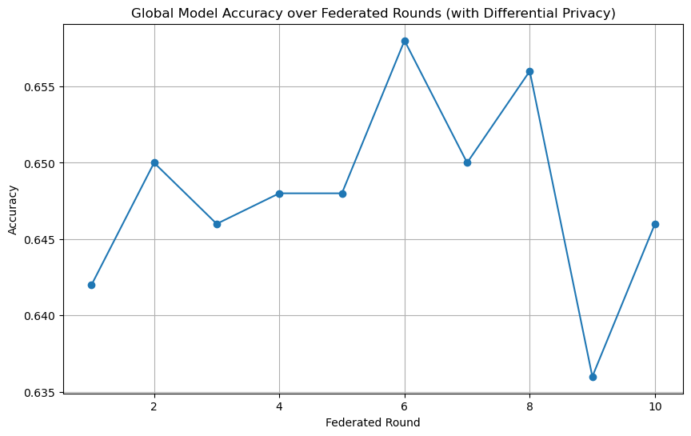

<p align="center">
  
</p>


SmartGuard is a privacy-preserving threat detection algorithm designed for mobile environments. It leverages **Federated Learning** and **Differential Privacy** to collaboratively train a machine learning model across multiple user devices **without sharing any raw data**.

---

##  Objective

To detect suspicious or malicious app behavior (e.g., spyware, data leaks) using on-device data while:
- Preserving user privacy
- Avoiding centralized data collection
- Ensuring secure and scalable threat intelligence

---

##  Core Algorithm

SmartGuard simulates a federated learning setup with the following features:
- **Multiple Clients:** Each simulating a user’s mobile device
- **Local Training:** Devices train models on their own behavioral data
- **Noise Injection:** Gaussian noise added to protect user privacy (Differential Privacy)
- **Secure Aggregation:** Server aggregates noisy updates to improve a global model

---

##  Simulation Parameters

| Parameter            | Description                                                  |
|----------------------|--------------------------------------------------------------|
| `NUM_CLIENTS`        | Number of participating devices (e.g., 5 in simulation)       |
| `NUM_ROUNDS`         | Number of federated training rounds (e.g., 10)               |
| `NOISE_STD`          | Standard deviation for Gaussian noise (controls privacy)     |
| `SAMPLES_PER_CLIENT` | Number of behavior records per client                        |
| `FEATURES`           | Number of features per sample (e.g., app activity metrics)   |

---

## Features Used (Simulated)

Each record contains synthetic features such as:
- App permission score
- Background activity frequency
- Network access patterns
- Mic and contact access flags
- Installation source (store vs sideload)

---

##  Files

| File Name                          | Description                                     |
|-----------------------------------|-------------------------------------------------|
| `smartguardAlgo.ipynb` | Jupyter Notebook simulation of the algorithm  |
| `plot.png`                         | Accuracy over federated rounds (visual result)  |
| `LICENSE`| MIT License|
| `README.md`                        | Project overview and documentation              |

---

## Result

The global model accuracy is tracked over federated rounds.  
Due to added noise, a slight fluctuation or drop in accuracy is expected — which demonstrates the **privacy-performance trade-off** clearly.

---

##  Use Cases

- Mobile security apps
- Privacy-preserving malware detection
- Federated IoT threat intelligence
- Enterprise device fleet security

---

##  Demo/Visualization




---

##  Getting Started

1. Clone the repo
   ```bash
   git clone https://github.com/Dheeraj-Chintala/smart-guard.git
   cd smart-guard

2. Install Depedencies
   ``` bash
   pip install numpy matplotlib scikit-learn
   
3. Run Notebook
   ```bash
   jupyter notebook smartguardAlgo.ipynb
